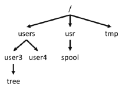

<div align="right">

</div>

# Embedded Systems Laboratory

# Laboratory 1: Introduction to Linux

## Objective 
The student will get familiar and remember the most common and useful commands for the Linux terminal environment. 

### __Activity 1. Know your hotkeys.__

1. Describe what the next hotkeys do (on a desktop environment): 
   1. ```<Ctrl><Alt><Backspace>```
   2. ```<Ctrl><Alt><Delete>```
   3. ```<Alt><Tab>```
   4. ```<Ctrl><Alt><F1...F6>```
   5. ```<Ctrl><Alt><F7>```
   6. ```<Ctrl><Alt><T>```

2. Describe what the next hotkeys do (on a terminal environment): 
   1. ```<Tab>```
   2. ```<Ctrl><C>```
   3. ```<Ctrl><D>```
   4. ```<Ctrl><Z>```
   5. ```<Arrow Up> or <Arrow Down>```

### __Activity 2. Commands__

1. Answer the following questions regarding the `MAN` Command.
	
   1. Explain the purpose of the MAN Command.
   2. How can you call the MAN Command?
   3. The MAN command has a specific format. Describe each section of this format:

<div align="center">

FORMAT | DESCRIPTION
:--- | :---
Name |                                                 	
Synopsis	
Description	
Hardware Dependencies	
Examples	
Files	
Return Value	
See Also	
Diagnostics	
Bugs	
Warnings	
Author	
</div>

2. Answer the following questions regarding the `PWD`, `LS`, `CD` Commands and more.
	
   1. Explain the purpose of the `PWD` Command and how do you call it.
   2. Open a terminal on any Linux environment and call the `PWD` Command. What does it print?
   3. Explain the purpose of the `LS` Command and how do you call it.
   4. The `LS` Command has some optional features [`-lFaR`] (first word is an under case “L”), describe them.
   5. Match the terminal input with their corresponding output.
      1. `$ ls -l dir2`
      2. `$ ls -F`
      3. `$ ls -R`
      4. `$ ls -a`

a)
``` 
    dir2 file1 file2 file3
	./dir2:
	f1 f2
```

b)
```
dir2/ file1 file2 file3*
```

c)
```
.profile dir2 file1 file2 file3
```

d)
```
-rw-rw-rw-1 user2 teacher 27 Jan 24 06:11 f1
-rw-rw-rw-1 user3 teacher 37 Jan 23 19:20 f2
```

3. Answer the following questions regarding the `CD` Command.
   1. Explain the purpose of the `CD` command and how do you call it.
   2. What is the difference between the following terminal inputs?
	```
    cd .	cd ..	cd ../..
    ```
   3. Given the following diagram; what would be the effect of the inputs below:

<div align="center">

</div>

   * `$ pwd → [Prints: /user/user3]`
   * `$ cd ..`
   * `$ pwd`
   * `$ cd usr`
   * `$ cd /usr`
   * `$ pwd`
   * `$ cd ../tmp`
   * `$ pwd`
   * `$ cd .`
   * `$ pwd`
	
      1. Which is my final position?
      2. Which command causes an error?


4. Complete the following terminal behavior:
```
	$ pwd
	/users/user3 ← [default current directory]
	$ cd /tmp
	$ pwd
	_____________________
	$ cd
	$ pwd
	_____________________
```	

5. Explain the purpose of the `MKDIR` Command and how do you call it.

6. Explain the purpose of the `RMDIR` Command and how do you call it.

7. From `HOME` directory, make the following directories with a single command line:
```
	Junk/dirA/dir1
	Junk/dirA
	Junk/dirA/dir2
	Junk/dirA/dir1/dirc
```
What single command did you use?


8. Answer the following questions regarding the `CP`, `MV` and `LN` Commands.
   1. Explain the purpose of the CP Command and how do you call it.
   2. Explain the purpose of the MV Command and how do you call it.
   3. Explain the purpose of the LN Command and how do you call it.
   4. Go to home directory on terminal and then type the following:
```
		$ nano southPole
		Narrator: “Hello Penguin”
		Penguin: “Is Mr. Penguin to you, sir”.
		<Ctrl><x>
		<y>
		<Enter>
```	
Verify that the file `southPole` is available. Write a command to copy this file into `Junk/dirA/dir2` (retain the name southPole).

   5. Once again type:
```
	$ nano eastPole
	Narrator: “Hello Polar Bear”
	Polar Bear: “Thats Dr. Polar Bear to you”.
	<Ctrl><x>
	<y>
	<Enter>
```
Verify that the file `eastPole` file is available. Write a command to rename this file into `northPole`, also move it to `Junk/dirA/dir1` (all in a single command line).

### __Activity 3. Super user__

1. Answer the following questions:
   1. Who is the super user in a Linux environment?
   2. What does the command “sudo su” means?
   3. What is the difference between using “sudo su” to go to super user and using only “sudo” at the start of a command?
   4. How do I know if I’m in super user mode?

### __Report__
Turn in a PDF, no longer than 3 pages, containing the following:
* Course name, delivery date, student name and student id
* Solution for Activity 1
* Solution and terminal screenshots for Activity 2
* Solution for Activity 3
* Include a short description of the problems faced throughout the lab development and the solutions you found
* Suggestions / commentaries
* Bibliography
