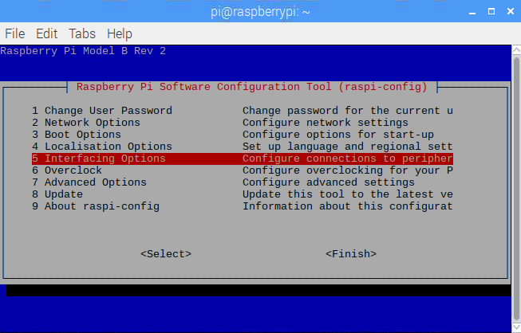
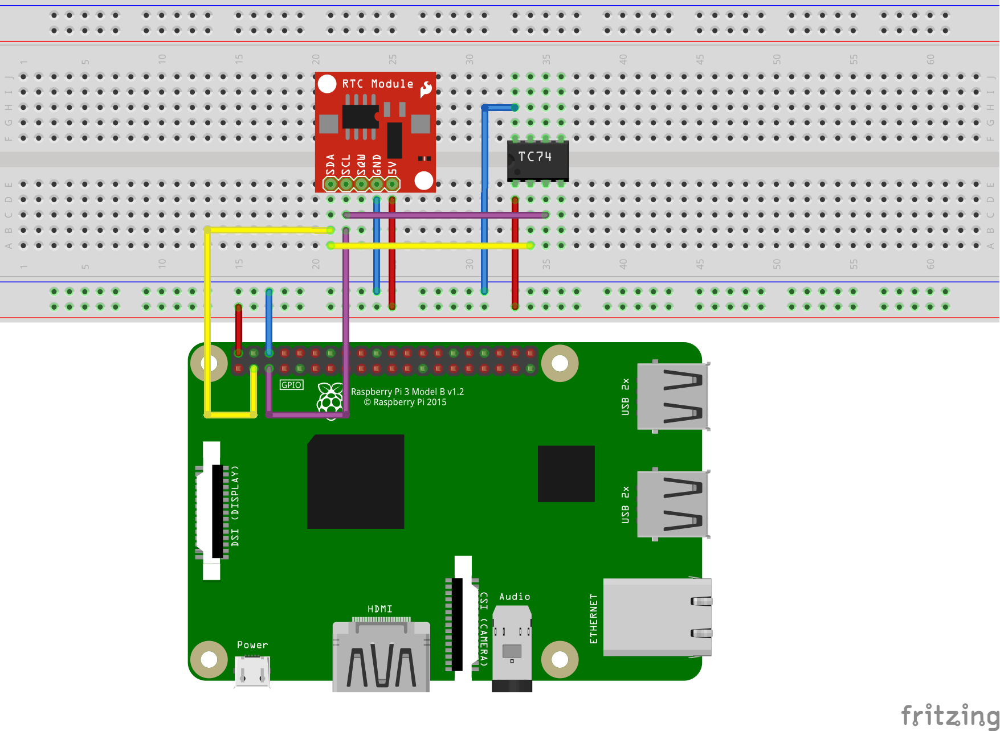

# I<sup>2</sup>C Interfacing with C (draft)

## Objectives
1. To transmit data through a I<sup>2</sup>C bus using the Raspbian terminal.
2. To implement a bus architecture using the I<sup>2</sup>C serial protocol with two sensors: Real Time Clock (RTC) and Thermometer.

## Pre-lab
### Background Research
In this pre-lab you will investigate the foundations of the I<sup>2</sup>C serial communications protocol, and understand its main characteristics. Moreover, You will learn about the requirements of sensors and devices to be I<sup>2</sup>C-compatible. 

1. Describe the I<sup>2</sup>C standard protocol. Include different aspects such as transfer speeds, handshake sequence, and a brief explanation of the two wires used for data transfer: SDA & SCL.

2. Identify the I<sup>2</sup>C Addresses of the following sensors (do not confuse with internal register address):
   * Real Time Clock (RTC) Module [[DS1338](https://datasheets.maximintegrated.com/en/ds/DS1307.pdf)]
   * Temperature Serial Sensor [[TC74](https://ww1.microchip.com/downloads/en/DeviceDoc/21462D.pdf)]

3. Draw a simple block diagram of the hardware setup for the I<sup>2</sup>C topology. Include the RPi (*master*), the DS1338 (*slave*), and the TC74 (*slave*). Also include the bidirectional Logic Level Converter (considering that the RPi works with 3.3 V and the optimal voltage for the sensors is 5 V).

### RPi Configuration
1. Open the Terminal and enable the I<sup>2</sup>C port:
```
$ sudo raspi-config
```
   * Go to *Interfacing Options* 



   * and enable **P5 I2C**


2. Then, restart the RPi:
```
$ sudo reboot
```
3. From a new Terminal window, install the **NTPdate** utility by typing in the following command:
```
$ sudo apt-get install build-essential manpages-dev ntpdate
```
4. Continue to download the C library for the Broadcom BCM 2835 microprocessor (find further info at http://www.airspayce.com/mikem/bcm2835):
```
$ wget "http://www.airspayce.com/mikem/bcm2835/bcm2835-1.58.tar.gz"
```
5. Uncompress the downloaded package:
```
$ sudo tar zxvf bcm2835-1.58.tar.gz
```
6. Once unpackaged, install the library in your system:
```
$ cd bcm2835-1.58
$ ./configure
$ make
$ sudo make check
$ sudo make install
```
## Lab work
### Part I. Hardware and Fire Test
The hardware setup, including the Raspberry Pi 3 + the Tiny RTC I<sup>2</sup>C modules DS1307 + the TC74 temperature sensor is shown below:



In your project, the Raspberry Pi must be able to communicate with both devices through the I<sup>2</sup>C protocol. 

Install the Python tools that allow I<sup>2</sup>C communications between the Raspberry Pi and hooked devices, as well as diagnostic tools:
```
$ sudo apt-get install -y python-smbus i2c-tools
```
Once installation is finished, test whether the modules are fully loaded:
```
$ lsmod | grep i2c_
i2c_bcm2835		16384 0
i2c_bcm2708		16384 0
```
You need the module **i2c_bcm2708** (or **i2c_bcm2835** on the Raspberry Pi Zero W). If you see the either modules, that means they are correctly loaded. To test the connections and find out the devices' address on the I<sup>2</sup>C bus, execute:
```
$ sudo i2cdetect -y 1
```
If everything goes well, you must see similar to the next figure:


**Report all the required steps and the printout of each step.**

Inside folder *bcm2835*, go to the I<sup>2</sup>C example following the route *bcm2835-1.58/examples/i2c/* and compile the code (you will need files *bcm2835.c* and *bcm2835.h* on this folder; you may acquire them from the *src* folder). Here is a hint:
```
$ gcc -o i2c i2c.c ../../src/bcm2835.c
```
Identify the corresponding code sections in *i2c.c* (the full source code can be also found at http://www.airspayce.com/mikem/bcm2835/i2c_8c-example.html) and answer the following:

1. How to begin a transfer?
2. How to set the address of the slave?
3. How to define read/write operations?
4. What is the meaning of *dlen* ?

### Part II. Bus Topology
Backup the *i2c.c* file and modify the code to obtain the data of seconds, minutes and hours from the RTC, and display it on the terminal. Your program should also set the current date and time onto the RTC. Demonstrate how to read individually each location of the RTC (seconds, minutes, etc.) by adjusting the RTC internal pointer. Log in the commands and take screenshots of your outputs. Finally, show how to read all the memory locations at once using terminal commands; show the commands and take screenshots of the outcomes.

Both, the TC74 and the RTC should be hooked up to the same I<sup>2</sup>C bus and must work as *slaves*; the Raspberry Pi should be set as *master*. Report your files with the final code. Report the commands to build and execute the program. Report printouts illustrating the correct operation of your program. Demonstrate to the professor your program working correctly.

Display the collected data on the terminal and log it in, in a .txt file. The logged data should follow the format showed below:
```
RECEIVER> Temperature: 24°C
RECEIVER> Record 1: 12/09/18 Sat 08:55:44 PM
RECEIVER> Record 2: 12/09/18 Sat 09:01:35 PM
RECEIVER> Record 3: 12/09/18 Sat 09:08:20 PM
```
Consider the following requirements:
* The recording table can only contain the 3 more recent events.
* These records must be initialized with the following date:
```
01/01/01 Mon 12:00:00 AM	
```
* If all the records are used, you must replace the oldest with the new one.
* You should report the temperature and the records every 10 seconds. 
