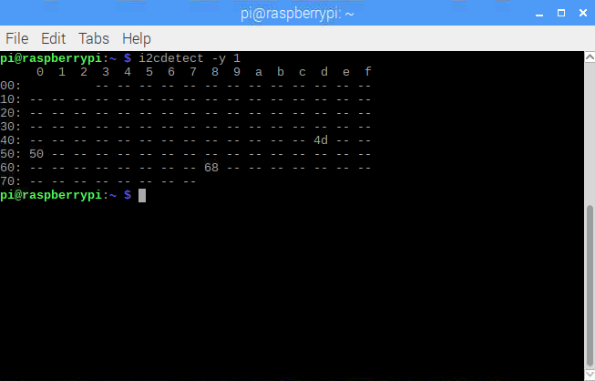

<p align="right">Last update: Mar 13, 2021</a></p>

# I<sup>2</sup>C Interfacing with C

## Objectives
1. To transmit data through a I<sup>2</sup>C bus using the Raspbian terminal.
2. To implement a bus architecture using the I<sup>2</sup>C serial protocol with two sensors: Real Time Clock (RTC) and Thermometer.

## Pre-lab
### Background Research
In this pre-lab you will investigate the foundations of the I<sup>2</sup>C serial communications protocol, and understand its main characteristics. Moreover, You will learn about the requirements of sensors and devices to be I<sup>2</sup>C-compatible. 

1. Describe the I<sup>2</sup>C standard protocol. Include different aspects such as transfer speeds, handshake sequence, and a brief explanation of the two wires used for data transfer: SDA & SCL.

2. Identify the I<sup>2</sup>C Addresses of the following sensors (do not confuse with internal register address):
   * Real Time Clock (RTC) Module [[DS1338](https://datasheets.maximintegrated.com/en/ds/DS1307.pdf)]
   * Temperature Serial Sensor [[TC74](https://ww1.microchip.com/downloads/en/DeviceDoc/21462D.pdf)]

3. Draw a simple block diagram of the hardware setup for the I<sup>2</sup>C topology. Include the RPi (*master*), the DS1338 (*slave*), and the TC74 (*slave*). Also include the bidirectional Logic Level Converter (considering that the RPi works with 3.3 V and the optimal voltage for the sensors is 5 V).

### Software Setup
1. Open the Terminal and enable the I<sup>2</sup>C port:
```
$ sudo raspi-config
```
   * Go to *Interfacing Options* 

<p align="center">
  
</p>

   * and enable **P5 I2C**

<p align="center">
  
</p>

2. Then, restart the RPi:
```
$ sudo reboot
```
3. From a new Terminal window, install the **NTPdate** utility by typing in the following command:
```
$ sudo apt-get install build-essential manpages-dev ntpdate
```
4. Continue to download the C library for the Broadcom BCM 2835 microprocessor (find further info at http://www.airspayce.com/mikem/bcm2835):
```
$ wget "http://www.airspayce.com/mikem/bcm2835/bcm2835-1.58.tar.gz"
```
5. Uncompress the downloaded package:
```
$ sudo tar zxvf bcm2835-1.58.tar.gz
```
6. Once unpackaged, install the library in your system:
```
$ cd bcm2835-1.58
$ ./configure
$ make
$ sudo make check
$ sudo make install
```
## Lab work
### Part I. Hardware and Fire Test
1. The hardware setup, including the Raspberry Pi 3 + the Tiny RTC I<sup>2</sup>C modules DS1307 is shown below (TC74 temperature sensor not shown):

<p align="center">
  
</p>

2. In your project, the Raspberry Pi must be able to communicate with both devices through the I<sup>2</sup>C protocol. Install the Python tools that allow I<sup>2</sup>C communications between the Raspberry Pi and hooked devices, as well as diagnostic tools:
```
$ sudo apt-get install -y python-smbus i2c-tools
```
3. Once installation is finished, test whether the modules are fully loaded:
```
$ lsmod | grep i2c_
i2c_bcm2835		16384 0
i2c_bcm2708		16384 0
```
4. You need the module **i2c_bcm2708** (or **i2c_bcm2835** on the Raspberry Pi Zero W). If you see the either modules, that means they are correctly loaded. To test the connections and find out the devices' address on the I<sup>2</sup>C bus, execute:
```
$ sudo i2cdetect -y 1
```
If everything goes well, you must see similar to the next figure:

<p align="center">
  
</p>

Three device' addresses have to be seen in the address map: RPi -> 0x50, TC74 -> 0x4D, and DS1338 -> 0x68. 

5. Examine the register map of an specific device using ```i2cdump -y 1 [i2c device address]```. As an example, to see the register map of the RTC:
```
i2cdump -y 1 0x68
```
Figure below shows the register content for the DS1338 right after been powered on: 

<p align="center">
  
</p>

As you write data to the devices' registers. you should be able to track changes from the register map.

5. Inside folder *bcm2835*, go to the I<sup>2</sup>C example following the route *bcm2835-1.58/examples/i2c/* and compile the code (you will need files *bcm2835.c* and *bcm2835.h* on this folder; you may acquire them from the *src* folder). Here is a hint:
```
$ gcc -o i2c i2c.c ../../src/bcm2835.c
```
6. Run the executable program and obtain the data of seconds, minutes and hours from the RTC, and display it on the terminal ([detailed info in the datasheet](https://datasheets.maximintegrated.com/en/ds/DS1307.pdf)). Keep in ming that the devices' address must be sent in **decimal notation**. Your program should also set the current date and time onto the RTC. Demonstrate how to read individually each location of the RTC (seconds, minutes, etc.) by adjusting the RTC internal pointer. Log in the commands and take screenshots of your outputs. Finally, show how to read all the memory locations at once using terminal commands; show the commands and take screenshots of the outcomes.

7. Finally, identify the corresponding code sections in *i2c.c* (the full source code can be also found [here](http://www.airspayce.com/mikem/bcm2835/i2c_8c-example.html)), and answer the following:

   1. How to begin a transfer?
   2. How to set the address of the slave?
   3. How to define read/write operations?
   4. What is the meaning of the *len* parameter?

### Part II. Bus Topology
1. Based on the *i2c.c* code, write a program that displays on the terminal and logs in a text file, the current temperature, as read from the TC74, and logs in the date and time every 10 seconds, or each time the temperature exceeds 30°C. Your data must be displayd and logged in following format shown below:
```
RECEIVER> Temperature: 24°C
RECEIVER> Record 1: 12/09/18 Sat 08:55:44 PM
RECEIVER> Record 2: 12/09/18 Sat 09:01:35 PM
RECEIVER> Record 3: 12/09/18 Sat 09:08:20 PM
```
Both, the TC74 and the RTC, should be hooked up to the same I<sup>2</sup>C bus and must work as *slaves*; the Raspberry Pi has to be set as *master*. Consider the following requirements:
* The data log must contain only the 3 most recent events.
* If the data log is full, the newest event replaces the oldest.
* These records must be initialized with the following date:
```
01/01/01 Mon 12:00:00 AM	
```
## Report 
Turn in a technical report containing the following:

1. Terminal commands to obtain data from the RTC on part I.6<sup>1</sup>.
2. Terminal commands to build and execute the program in C, writen on Part II.1.<sup>1</sup>.
3. Link to your GitHub repository containing the codes for Lab work, including parts I and II.
4. Link to your demostration video for parts I and II.
5. Individual conclusions of Laboratory 5. Elaborate your paragraph(s) based on the following guidelines:
   * Which was the most challenging part of this lab work and why?
   * What application would you propose to solve, at least partially, using an embedded system similar to the one used in this lab (RPi + DS1338 + TC74)?
   * What any other applications (and sensors that would be required, in such case) come to your mind to implement as an embedded system, along with the RPi, to replace a chore around your home? (intelligent doorlocks, smart lighting, automatic plant watering, etc.) 

<sup>1</sup>Include screenshots showing the outcomes from the Terminal, which in turn, must include captions describing the figure.