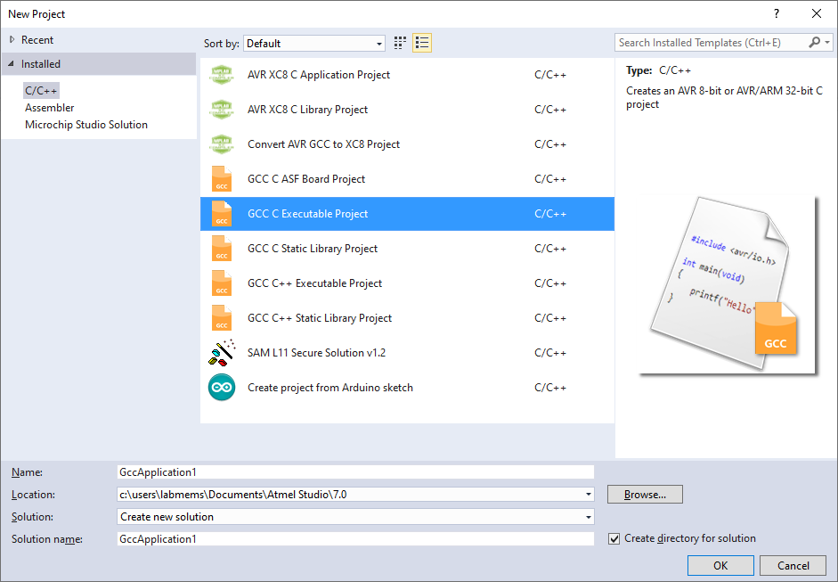
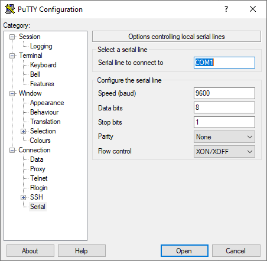

# C Programming and I<sup>2</sup>C interfacing in Arduino Zero

## Objectives
* Strengthen your knowledge and abilities about C programming and serial communication protocols, specifically I<sup>2</sup>C. 
* Learn how to program timers and develop interfaces to I<sup>2</sup>C peripherals specifically the real time clock (RTC).

## Introduction
This lab provides you the opportunity to learn how to develop embedded software applications by following the steps and practices commonly used in industry. In this lab, you will learn to write C language code using the header files and source files provided by ATMEL. Your will also develop your own header and source files to access and manipulate a real time clock. This lab will also provide you the opportunity to strengthen your knowledge about the i2c protocol by programming an interface to the real time clock and by observing and measuring timing of the i2c signals using the oscilloscope. The oscilloscope for this lab has additional software licenses (and expensive) software to show a decoded view of the i2c signals. 

## Materials and Software
<div align="center">

Qty | Material
:---: | :---
1  | Arduino Zero
1  | Micro-USB cable
1  | Real Time Clock
1  | Oscilloscope (serial communications-capable)
1  | FTDIO for serial communications
1  | Miniusb cable
 As required  | Wiring cables (male to female pin header cables)

 | Software
 | :---
 | Latest version of [Microchip Studio for AVR and SAM Devices](https://www.microchip.com/en-us/development-tools-tools-and-software/microchip-studio-for-avr-and-sam-devices) running on Windows
 | Latest version of [PuTTY [2.7 MB]](https://www.putty.org/) running on Windows

 </div>

## Part I. Translate the code of timer to C
Given the following code:
```assembly
main:  //PORT configuration for general-purpose PIN
                 	LDR  R0, =0x41004400 //PORT Base Address
                 	LDR  R1, =0b00000000 //config value
                 	LDR  R2, =0x4E
                 	STRB R1, [R0, R2]	//PINCFG14
                 	LDR  R2, =0x00004000 //PA14 bit set position
                 	STR  R2, [R0, #0x08] //DIRSET -- data direction as output
    	//TIMER configuration
          	//Configure the POWER MANAGER to enable the TC3 module
                 	LDR  R3, =0x40000400 //PM Base Address
                 	LDR  R1, [R3, #0x20] //read register APBCMASK
                 	LDR  R4, =0x00000800 //mask value
                 	ORRS R1, R1, R4  	//to set desired bit(s)
                 	STR  R1, [R3, #0x20] //APBCMASK
          	//Configure the GENERIC CLOCK CONTROL used by the TC3 module
                 	LDR  R3, =0x40000C00 //GCLK Base Address
                 	LDR  R1, =0      	//config value
                 	STR  R1, [R3, #0x08] //GENDIV
                 	LDR  R1, =0x10600	//config value
                 	STR  R1, [R3, #0x04] //GENCTRL
                 	LDR  R1, =0x401B 	//config value
                 	STRH R1, [R3, #0x02] //CLKCTRL
          	//Determine the initial count
          	//Time = Toscillator * (2^TIMERMODE - COUNT) * Prescaler
                 	LDR  R3, =0x42002C00 //TC3 Base Address
                 	LDR  R6, =65307  	//initial count of the timer + 27 cycles
                 	STRH R6, [R3, #0x10] //COUNT          	
          	//Configure the TC3 peripheral
                 	LDR  R1, =0      	//config value
                 	STRH R1, [R3]    	//CTRLA
                 	STRB R1, [R3, #0x05] //CTRLBSET
                 	LDR  R5, =0x1    	//to clear OVF flag
                 	STRB R5, [R3, #0x0E] //INTFLAG
          	//Enabling the TC3 peripheral
                 	LDR  R1, [R3]    	//reads CTRLA
                 	LDR  R4, =0x2    	//mask value
                 	ORRS R1, R1, R4  	//to set desired bit(s)
                 	STRH R1, [R3]    	//CTRLA
          	//Loop to sync the TC clock with the processor/main clock
                 	LDR  R4, =0x80   	//mask value
read:     	   	LDRB R1, [R3, #0x0F] //reads STATUS
                 	ANDS R1, R1, R4  	//to test SYNCBUSY bit
                 	BNE  read        	//jump if it not synchronize
   	//***************************************************************************
          	//Loop to generate the square-wave signal
            //EXTRA cycles to ADD to the initial count---it will be still a 
            //polling-error of +/- 7 us in the period of the signal
            //LDRB(4) + ANDS(1) + BEQ(2) + LDRB(4) + ANDS(1) + BEQ(1) + STR(4) + 
            //STRB(4) + STRH(4) + B(2) = 27 cycles
again:    	   	    LDRB R1, [R3, #0x0E] //reads the INTFLAG
                 	ANDS R1, R1, R5  	//to test OVF flag
                 	BEQ  again       	//jump if is not overflowed
                 	STR  R2, [R0, #0x1C] //toggle the output pin
                 	STRB R5, [R3, #0x0E] //clear OVF flag
                 	STRH R6, [R3, #0x10] //recharge the initial COUNT
                 	B	again

```
1. Use the [SAMD21 microcontroller datasheet](https://drive.google.com/file/d/1ioVVR1NGN9EGv17DAQoz2EE7NLV9ePyL/view?usp=sharing) to explain the procedure to configure the timer. List the different &mu;C registers, the values assigned to each register and the corresponding configuration. 

2. Translate the assembly language instructions into C language statements. Use the following files to identify the structures in which the timer registers are located.

<div =align="center">

Peripheral | Include file
:--- | :---
**System Clocks (GCLK)** (structure, defines, unions) | C:\Program Files (x86)\Atmel\Studio\7.0\packs\atmel\SAMD21_DFP\1.2.280\samd21a\include\component\gclk.h
**Power Management (PM)** (structure, defines, unions) | C:\Program Files (x86)\Atmel\Studio\7.0\packs\atmel\SAMD21_DFP\1.2.280\samd21a\include\component\pm.h
**Ports (GPIO)**  (structure, defines, unions) | C:\Program Files (x86)\Atmel\Studio\7.0\packs\atmel\SAMD21_DFP\1.2.280\samd21a\include\component\port.h
**Timers** (structures, defines, unions) | C:\Program Files (x86)\Atmel\Studio\7.0\packs\atmel\SAMD21_DFP\1.2.280\samd21a\include\component\tc.h

</div>

### Example
```C
#include "sam.h"
 
#define PINCFG_CONFIG_VALUE 0b00000000
 
int main(void) {

   	/* Initialize the SAM system */
	SystemInit();
 
    //PORT configuration for general-purpose PIN
   	PORT->Group[0].PINCFG[14].reg = PINCFG_CONFIG_VALUE;
   	PORT->Group[0].DIRSET.reg = PORT_PA14;
   	//TIMER configuration
   	//Configure the POWER MANAGER to enable the TC3 module
        	PM->APBCMASK.reg |= PM_APBCMASK_TC3;
   	//Configure the GENERIC CLOCK CONTROL used by the TC3 module
        	…
        	…
```
3. Create a new project in Atmel Studio and copy the example code; then, complete the code...

   a) Open a project in ATMEL Studio
      1. Select the GCC C Executable version

      2. Change the GCCApplicationX  name to your prefered name.

      3. Double click at the application main.c file at the “Solution Explorer. The text editor will become open and you are ready to write the code. 
      
      4. Open a C file and start coding.

<p align="center">
  
</p>

4.	Share your code written in C language and the program working correctly with the professor. Remember to write the code using functions, e.g. a function to initialize the timer. Add the image of the generated waveform.

5.	Explain the section of the code where the “polling operation” is taking place.

## Part II. Interfacing the RTC through I<sup>2</sup>C
Get a copy of the *rtc_i2c.c* code.

1. Using the datasheet of the SAMD21 microcontroller, explain the procedure to configure the i2c peripheral. List the different microcontroller registers, the values assigned to each register and the corresponding configuration. Draw an activity diagram with the configuration procedure.

2. Identify the existing structures/unions defined by ATMEL to configure/use the i2c peripheral.
<div align="center">

Peripheral | Include file
:---: | :---
I<sup>2</sup>C (structure, defines, unions)  | C:\Program Files (x86)\Atmel\Studio\7.0\packs\atmel\SAMD21_DFP\1.2.280\samd21a\include\component\sercom.h

 </div>

 3.	Review the datasheet of the RTC to answer the following questions.
    * What is the ADDRESS of the RTC?
    * Find in the datasheet the packet sequence to write to the slave. Report a drawing of this transfer packet.
    * Find in the datasheet the packet sequence to read from the slave. Report a drawing of this transfer packet.

4. Report a schematic diagram illustrating the wiring connections between the SAMD21 and the RTC.
<p align="center">
  
</p>

5.	Create a new project in Atmel Studio and copy the provided code. Run the program step by step.

    1. Open a project in ATMEL Studio
        1. Select the GCC C Executable version
        2. Change the GCCApplicationX  name to your prefered name.
        3. Double click at the application main.c file at the “Solution Explorer”. The text editor will become open and you are ready to write the code. 
        4. Open a C file and copy the provided code “rtc_i2c.c”.

    2. After executing the program step by step and before starting the “sending sequence”, what are the values “to be sent” to the RTC?. These values are located at the tx_buf[] buffer. Demonstrate to the professor that you can read these values using the Debugger.

    3. Review the code and explain using an activity diagram the steps needed to write values to the RTC and the steps needed to read information from the RTC. Report these diagrams.

    4. What memory locations of the RTC were written? and what are the values at these locations after completing the “sending sequence”? Report this findings.

    5. After executing the “receiving sequence”, were the values correctly recovered?. Report the recovered values. 

    6. What is the purpose of the code “RELOCATING POINTER BEFORE RECEIVING”? If you write comments to this code, is the code working as expected? Report your explanation and findings. 

6.	Test a sample program to display information at the windows terminal (Putty).

    1. Create a new project and import (drag the files into the project) the following files: “main.c,” “myprintf.h,” “myprintf.c”.

    2. Open the putty application on the computer.

    3. Report the schematic diagram between the Arduino Zero and the FTDI.

    4. Open the setup of a serial communication on this software go to “Serial” under “Connection” and configure the following parameters:
    <p align="center">
    
    </p>

    6. Go back to session, select _**Serial**_ connection type and click _Open_.
    <p align="center">
    
    </p>

    7. Add a “Hello World” printf to the program and run the program (using the debugger) to demonstrate to the professor that the information is being displayed on the Terminal. Add an image of the terminal with the “Hello World”.

7. Using C language unions and structures, define structures to access/manipulate the information of the RTC. These structures/unions should be located at the “RTCControl.h” file. Report your .h file with comments.

### Example
```C
#define MONTH_ADDR 0x05
typedef union {
    struct  { 
        uint8_t un_month  	:4,
         	    dec_mont    :1,
                RESERVED    :3;
    } field;
    uint8_t reg;
} month_type;
```
Remember that header files have the following directives at the beginning and end of the file in order to prevent compilation errors. 
```C
#ifndef RTCCONTROL_H_               /*this goes at the top of the document”
#define RTCCONTROL_H_
 
#endif /*RTCCONTROL_H_*/          /*this goes at the bottom of the document”
```

8. Modify the provided code to incorporate the following C functions. Write the function prototype definitions at the “RTCControl.h” file. Write the body of the functions at the “RTCControl.c” file.
    1. ```void sendI2CDataArray(SlAddr, ptr, ptrData, Size)```
        
        This function writes the data located in the array to the RTC.

        ```SlAddr``` is the slave address, ```ptr``` is the address for the internal pointer of the RTC, ```ptrData``` is a pointer to the 8-bit data array, and ```Size``` is the number of elements in the array.
    2. ```void SendI2CData(Data)```

      	```Data``` is the 8-bit data to send.  
    3. void StopCond()
      	
          Function to generate a stop condition.
    4. ```void receiveI2CDataArray(SlAddr, ptr, ptrData, Size)```

         This function reads the data from the RTC and stores this data at the Data array.
    
        ```SlAddr``` is the slave address, ```ptr``` is the address for the internal pointer of the RTC, ```ptrData``` is a pointer to the 8-bit data array, and ```Size``` is the number of elements in the array.

 9. Rewrite the provided program and develop an application that does the following.
    1. The program should initialize the RTC with the current time and date only once.

    2. The program should display the RTC time in your PC at the terminal (Putty) all the time. 

    To do this you will need:

    * Include the new .h files (you can drag the files into the project (project name)).
    * Modify the main program to include calls to the functions that you develop in item 8.
    * To “print” to the terminal the information coming from the real time clock using one-line message similar (Also known as TIMESTAMP) to this:

	    Date/Month/Year/Hours/Seconds/Minutes

    To print the month you may type:

    ```myprintf(“%d%d/”, xRTC.DATE.field.dec_month, xRTC.DATE.field.un_month);```

10.	Demonstrate to the professor that your new code works and explain the structure of your new code.