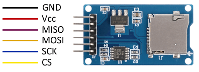
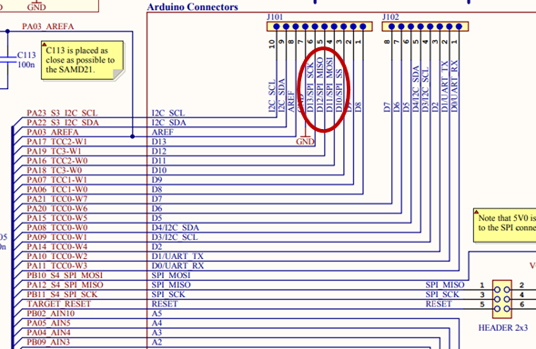
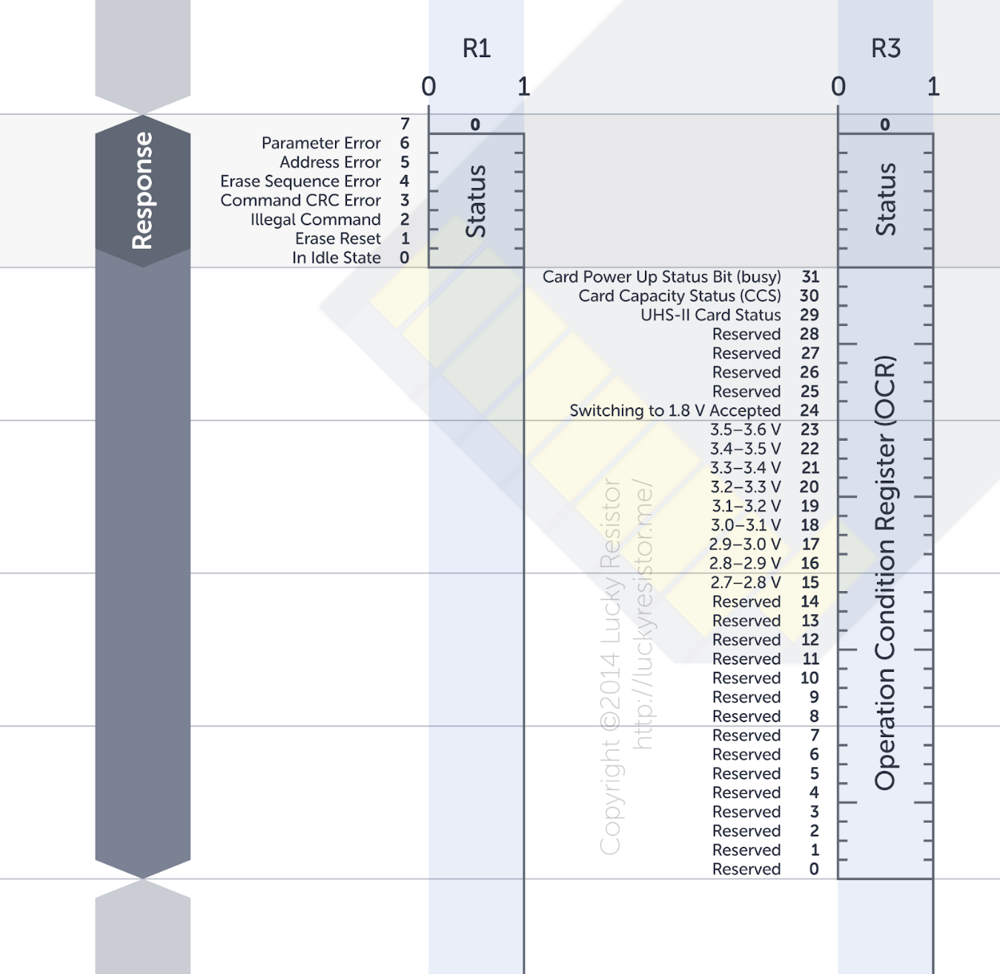
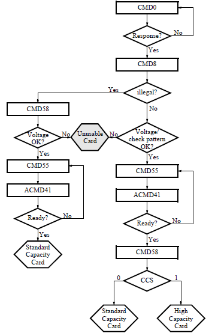

<div align="right">
    
</div>

# Laboratory 7. SPI and SD Interfacing with Arduino Zero (draft)

## **Introduction**
This lab provides you the opportunity to learn how to develop embedded software applications by following the steps and practices commonly used in industry. In this lab, you will learn to write C language code using the header files and source files provided by ATMEL. You will also develop your own header and source files to access and manipulate a SD shield. This lab will also provide you the opportunity to strengthen your knowledge about the SPI protocol by programming an interface to the SD shield and by observing and measuring the SPI signals using the oscilloscope. 

### Objectives
* Strengthen your knowledge and abilities about C programming and serial communication protocols, specifically SPI. 
* Learn how to write programs using the SPI protocol to interface to an SD card.

### Materials and software
<div align="center">

Qty | Material
:---: | :---
1 | Arduino Zero
1 | SD shield 
1 | SD card 4GB FAT32 formatted
1 | Oscilloscope
1 | FTDIO for serial communications
1 | USB-MiniUSB cable
1 | USB-MicroUSB cable

</div>

Alongside, you will need serial communications tools such as _myprintf_, _uart.c_ and _uart.h_; Microchip Studio and PuTTy.

## **Procedure**

### __Part I. SPI protocol and interfacing with the SD shield__
1. Connect the SPI port from the SAMD21 microcontroller to the SD shield. Report an schematic diagram with the connections between the Arduino Zero and the microSD shield.

<div align="center">


</div>

2. Create a new *GCC C Executable* project on Microchip Studio for the __ATSAMD21G18A__ &mu;Controller.

3. Create the header file _spi.h_, and paste in the following code listing:
```c
#ifndef SPI_H_
#define SPI_H_

#define BAUDRATE 9600

void spiInit( void );
uint8_t spiSend( uint8_t data );

#endif /* SPI_H_ */
```

4. Then, create _spi.c_, and add the following code listing:
```c
void spiInit( void ) {
	/* Switch to 8MHz clock (disable prescaler) */
	SYSCTRL->OSC8M.bit.PRESC = 0;

	PM->APBCMASK.bit.SERCOM1_ = 1; //enable the clock for SERCOM1 peripheral
	GCLK->CLKCTRL.reg = GCLK_CLKCTRL_CLKEN | GCLK_CLKCTRL_GEN_GCLK0 | GCLK_CLKCTRL_ID_SERCOM1_CORE;
	while( GCLK->STATUS.bit.SYNCBUSY ) { }
	
	//structures to configure the SERCOM1 peripheral
	const SERCOM_SPI_CTRLA_Type ctrla = {
		.bit.DORD = ??, // MSB first
		.bit.CPHA = ??, // Mode 0
		.bit.CPOL = ??,
		.bit.FORM = ??, // SPI frame
		.bit.DIPO = ??, // MISO on PAD[3]
		.bit.DOPO = ??, // MOSI on PAD[0], SCK on PAD[1], SS_ on PAD[2]
		.bit.MODE = ??  // Master Mode
	};
	SERCOM1->SPI.CTRLA.reg = ctrla.reg;	
	const SERCOM_SPI_CTRLB_Type ctrlb = {
		.bit.RXEN = ??,   // RX enabled
		.bit.MSSEN = ??,  // Manual SC
		.bit.CHSIZE = ??  // 8-bit
	};
	SERCOM1->SPI.CTRLB.reg = ctrlb.reg;

	//Formula to configure the desired baudrate
	uint32_t br = ( double )( 8000000 / ( 2 * BAUDRATE ) ) - 1 ;
	SERCOM1->SPI.BAUD.reg = SERCOM_SPI_BAUD_BAUD( ( uint8_t )br );

	//structure to configure multiple PINs
	const PORT_WRCONFIG_Type wrconfig = {
		.bit.WRPINCFG = 1,
		.bit.WRPMUX = 1,
		.bit.PMUX = MUX_PA16C_SERCOM1_PAD0 | MUX_PA17C_SERCOM1_PAD1 | MUX_PA19C_SERCOM1_PAD3,
		.bit.PMUXEN = 1,
		.bit.HWSEL = 1,
		.bit.PINMASK = ( uint16_t )( ( PORT_PA16 | PORT_PA17 | PORT_PA19 ) >> 16 )
	};
	PORT->Group[0].WRCONFIG.reg = wrconfig.reg;

	//SS/CS (Slave Select/Chip Select) PIN 18 configuration
	REG_PORT_DIRSET0 = PORT_PA18;
	REG_PORT_OUTSET0 = PORT_PA18;
	
	//enable the SPI
	SERCOM1->SPI.CTRLA.bit.ENABLE = 1;
	while( SERCOM1->SPI.SYNCBUSY.bit.ENABLE ) { }
}
```
5. Read pages 478-510 of the SAMD21 datasheet to find out undefined `??` values in the code above, and replace them with their respective values. 

6. Draw and report a flow chart of the initialization process for the SPI.

7. Add the remain following code to your _spi.c_ file:
```c
uint8_t spiSend( uint8_t data ) {
	uint8_t temp;
	while( ?? ) { } //wait until buffer is empty
	?? = SERCOM_SPI_DATA_DATA( data ); //transmit data
	while( ?? ) { } //wait until a data is received
	temp = ??; //read data
	while( !SERCOM1->SPI.INTFLAG.bit.TXC ) { } //wait until there is no data to transmit
	myprintf( " %x", temp ); //printf the value in putty
	return temp;
}
```
8. Continue replacing the unknown `??` values for function `spiSend()`. 

9. Draw and report a flow chart indicating the steps to send values with this function.

10. Capture the following code in your main program.
```c
int main(void)
{
   	SystemInit();
   	spiInit();
 
   	volatile uint8_t rData;
   	volatile uint8_t sData = 85;
   	while (1) {
			REG_PORT_OUTCLR0 = PORT_PA18; //initiate transaction by SS_low
          	rData = spiSend( sData );
			REG_PORT_OUTSET0 = PORT_PA18; //finish transaction by SS_high
   	}
}
```
11. Share your C code. Remember to write the code using functions. Add an image of the generated SPI signal over the `MOSI` and `SS` channels. Justify the observed waveform. Was the signal observed on the oscilloscope the expected waveform?

12. Add _myprint.h_ and _myprint.c_ files to the project. Create and define the content of the _uart.c_ and _uart.h_ files. These files should have the code needed to configure the UART port to be used by `myprintf()` function to display data at the terminal. Report and demonstrate your working code. 

### __Part II. Communicating with the SD__
The SD has a set of commands available for communication. For further information on this, check out lecture on SPI and SD cards from Universitty at Buffalo:
<div align="center">

[](http://www.dejazzer.com/ee379/lecture_notes/lec12_sd_card.pdf)
</div>

The following table shows relevant commands with arguments and their corresponding response: 

<div align="center">

Command | ID | Argument | Response
:--- | :--- | :--- | :---
Go Idle State | CMD0 | 0 | R1
Send If Cond | CMD8 | ... | R7
Stop Transmission | CMD12 | 0 | R1
Set Block Length | CMD16 | Length | R1
Read Single Block | CMD17 | Block | R1
Read Multiple Blocks | CMD18 | Start Block | R1
Application Command | CMD55 | 0 | R1
Read OCR | CMD58 | ... | R3
</div>

To communicate with the SD card, your program has to place the SD card into the SPI mode. To do this, set the MOSI and CS/SS lines to logic value 1 and toggle SD CLK for at least 74 cycles. After the 74 cycles (or more) have occurred, your program should set the CS line to 0 and send the command CMD0:

    `01000000 00000000 00000000 00000000 00000000 10010101`

The command is captured in C language as illustrated below:

```c
#define kCMD00 0x40
#define SIZE_SD_CMD 0x06
const uint8_t CMD00[SIZE_SD_CMD] = {0x40, 0x00, 0x00, 0x00, 0x00, 0x95};
```

This is the `reset` command, which puts the SD card into the SPI mode if executed when the `CS/SS` line is low. 

The SD card will respond to the `reset` command by sending a basic 8-bit response through the MISO line. The structure of this response is shown in the figure below. The first bit is always `0`, while the rest specify any errors that may have occurred while processing the last message. If the command you sent was successfully received, you will receive the message `0000 0001`.

<figure align=center>
    
    <figcaption><b>Responses to commands.</b> Depending upon the command, there are different responses. The specification is calling them R1, R3 or R7. There are more possible responses, but these are the most important.</figcaption>
</figure>

To receive this message, your program should continuously toggle the `SD CLK` signal and watch the `MISO` line for data, while keeping the `MOSI` line high and `CS` line low. 

Your program can detect the message because every message begins with a `0` bit, and when the SD card sends no data, it keeps the `MISO` line high. Note that the response to each command is sent by the card a few `SD CLK` cycles later. If the expected response is not received within 16 clock cycles after sending the reset command, the reset command has to be sent again.

Following a successful `reset`, test if your system can successfully communicate with the SD card by sending a different command. For example, send one of the following commands, while keeping the `CS` value at `0`:

* **CMD08 - request the contents of the operating conditions register for the connected card.**

    `01001000 00000000 00000000 00000001 10101010 10000111`

A response to these commands consists of 40 bits, where the first 8 bits are identical to the basic 8-bit response, while the remaining 32 bits contain specific information about the SD card. If successful, the first 8 bits of the response will be either `0000 0001` or `0000 0101` depending on the version of your SD card.

#### __Sending commands to the SD__
Complete the C program illustrated below that allows a user to input a 48-bit command on the keyboard and send it to the SD card via SPI. 

1. Complete the line associated to the CMD08 command. Type in the missing hex values.

2. Review the function `spiXchg()`. Identify the part of this function that __sends__ the command to the SD. Report the identified code and a generate a flowchart of this process. 

3. Review the function `spiXchg()`. Identify the part of this function that __receives__ the response from the SD. Report the identified code and a flowchart of this process. 

4. Complete the main program with the code to send the first two commands (__CMD00__ and __CMD08__) to the SD, and receive the two responses from the SD. Identify the responses and explain their meaning. Report the code and the interpretation of the responses. Demonstrate to the professor the execution of the program and the interpretation of responses. 

Review the program and the values displayed at the terminal and answer the following questions.

1. When sending each byte of the command, what is the value being received from the SD card?

2. When receiving the response from the SD card, what is the value being sent to the SD card?

```c
#define RXBUFSIZE 0x400
#define LENGTH_R1 0x03
#define LENGTH_R7 0x07

void initCycles(void);

#define SIZE_SD_CMD 0x06
#define kCMD00 0x40
#define kCMD08 0x48
#define kCMD55 0x77
#define kCMD41 0x69

const uint8_t CMD00[SIZE_SD_CMD]  ={0x40, 0x00, 0x00, 0x00, 0x00, 0x95};
const uint8_t CMD08[SIZE_SD_CMD]  ={__________________________________};
uint8_t CMD17[SIZE_SD_CMD]  ={0x51, 0x00, 0x00, 0x00, 0x00, 0x01};
uint8_t CMD172[SIZE_SD_CMD]  ={0x51, 0x00, 0x00, 0x08, 0x00, 0x01};
const uint8_t CMD18[SIZE_SD_CMD]  ={0x52, 0x00, 0x00, 0x00, 0x00, 0x01};
const uint8_t CMD55[SIZE_SD_CMD]  ={0x77, 0x00, 0x00, 0x00, 0x00, 0x65};
const uint8_t CMD41[SIZE_SD_CMD] = {0x69, 0x40, 0x00, 0x00, 0x00, 0x77};

uint8_t RxBuffer[RXBUFSIZE];

int main(void)
{
  uint32_t temp = 0xFF;
  /* Initialize the SAM system */
  SystemInit();

  initUART();
  spiInit();

  initCycles();
  //myprintf("\n");
	
  spiXchg( CMD00, SIZE_SD_CMD, RxBuffer );  /* reset instruction */
  myprintf("\n");

  //Write your code here

  myprintf("\nDone");
}

void initCycles(void){
	uint32_t i;
	REG_PORT_OUTSET0 = PORT_PA18;
	for(i=0;i<76;i++)
	spiSend(0xFF);
}

//ADD spiXchg FUNCTION TO THE “spi.c” FILE

uint32_t spiXchg(const uint8_t * send_buff, uint32_t bc, uint8_t * receive_buff ) {
	uint8_t temp = 0xFF;
	uint32_t i;
	uint8_t temp_cmd = send_buff[0];
	
	REG_PORT_OUTCLR0 = PORT_PA18;
	for(i=0; i< bc; i++) {
		temp = spiSend(*(send_buff++));
		myprintf(" %x", temp);
	}
	switch(temp_cmd) {
		case kCMD00 :
			for(i=0; i<LENGTH_R1; i++) {
				temp = spiSend(0xFF);
				myprintf(" %x", temp);
			}
			break;
		case kCMD08 :
			for(i=0; i<LENGTH_R7; i++) {
				temp = spiSend(0xFF);
				myprintf(" %x", temp);
			}
			break;
		case kCMD41 :
			for(i=0; i<LENGTH_R1-1; i++) {
				temp = spiSend(0xFF);
				myprintf(" %x", temp);
			}
			spiSend(0xFF);
			break;
		case kCMD55 :
			for(i=0; i<LENGTH_R1; i++) {
				temp = spiSend(0xFF);
				//myprintf(" %x", temp);
			}
			break;
		default :
			myprintf("\n Error in CMD");
	}
	REG_PORT_OUTSET0 = PORT_PA18;
	return(temp);
}
```

### __Part III. Initializating the SD__
1. To initialize the SD card correctly, you have to send a command sequence and process the responses received. Once you complete the procedure, you will be able to access the data stored on the SD card.

   The steps necessary to complete the SD card initialization are shown in the flowchart below. The flowchart consists of boxes with a specific command at each box. Starting from the top, each command has to be sent to the SD card, and a response has to be received. In some cases, a response from the card needs to be processed to decide the next course of action.

<figure align="center">
    
</figure>

   1. To begin initialization, set the `MOSI` and `CS` lines to logic 1 and toggle the `SD CLK` for at least 74 cycles. 

   2. Next, follow the initialization procedure outlined in the flowchart, while keeping the `CS` line low at all times. 
      1. The first command to send is the `reset` command. __CMD0__ sets the SD card into SPI mode. The SD card should respond to this command with the 8-bit message `00000001` indicating no errors. If the SD fails to respond, the command should be sent again.
      2. The second command, __CMD08__, determines if the SD card is compliant with version 2.00 of the SD card specifications. In reply to __CMD08__, the SD card will issue a 40-bit response. The response indicates how to proceed with the initialization.
         * If bit 34 is set to 1 then the SD card is an older model and should be initialized following the left branch of the flowchart. 
      3. If the command is valid and no errors occurred, then verify if the check pattern in the response is `10101010` and that the voltage field is set to `0001`. If either of these conditions fails, the SD card will not function correctly and you should stop the initialization procedure. Otherwise, proceed with the initialization steps of version 2.00 compliant SD card, following the right-hand side of the flowchart. 
      4. For the case of an old SD card, the next step of the initialization procedure is to send CMD58 to obtain the contents of the Operating Conditions Register (OCR). The OCR indicates the voltage levels the SD card can work with. 
      5. To determine if the SD card is ready for exchange of data, the program should send two commands to the SD card: __CMD55__, followed by __ACMD41__. The argument in each of these commands must be `0`. After each command is sent, the SD card will respond. Of particular interest is the response to command __ACMD41__. The response is a basic 8-bit response. It is expected that the bit `in idle state` will remain `1` for a while. However, the bit will be set to `0` when the card is ready. If it is not, try sending the pair of commands over again and again until the response received is `0000 0000`.

2. Complete the main program to initialize the SD card as described above. The program should send the sequence of commands (all with the argument field set to 0, except for CMD08) to initialize the SD card and display the response to each command in the terminal window. When needed, your program should scan the response and proceed with the initialization only if the correct response has been received.

   * What is the purpose of the `initCycles()` function? Report the answer to this question.

   * Complete the command sequence at the main program just below the code written for PART II. Write the code to send the additional commands __CMD55__ and __CMD41__ (also known as __ACMD41__). The code should make sure that the SD card is ready to continue to Part IV. Report the modifications to the main program. Demonstrate to your professor that the program checks for the responses and continues when the SD is ready (response is zero).

### __Part IV. Reading the SD sector__
Use a `read` command to access data on the SD card. __CMD17__ can be used to read a 512-byte segment of data from the card. A standard-capacity SD card takes as argument the byte-wise address of the data to be accessed on the card and returns a block of 512 bytes that begins at the specified address. The command is only valid if the argument is a multiple of 512. Any other address passed as an argument will result in a response with the `address error` bit set. If a correct address is provided as an argument in __CMD17__ and the card is able to access the specified memory segment, a response `00000000` (zero) giving an indication of no errors will be sent by the SD card. Following this response, the card will immediately begin sending the requested data through the `MISO` line. The data sent by the card should be ignored until a byte comprising `0xFE` is received. This byte indicates the beginning of a data packet.

1. Check the function `rcvr_datablock()`. Identify the part in this function that sends the command to the SD and:

   1. Complete the code that is missing.
   2. Report the identified code and a flowchart of this part. 
   3. Report the answer to the following questions:

      1. What arguments of the function are related to this part of the code? What information are these arguments providing?
      2. Explain how the __CMD17__ command argument is being passed to the SD. What is this argument for?

2. Check the function `rcvr_datablock()`. Identify the part of this function that receives the response from the SD. Report the identified code and a flowchart of this part. 
   1. What arguments of the `rcvr_datablock()` function are related to this part of the code? What information are these arguments providing? Report the answer to these questions.

3. Complete the main program with the code to read the first 512-byte sector of the SD. Identify the responses and explain their meaning. Report the code and the interpretation of the responses. Demonstrate to the professor the execution of the program and the interpretation of responses. Report the content of the memory locations of the first 512-byte block of the SD. Demonstrate the content of this first block to the professor.

```c
void rcvr_datablock(const uint8_t * send_buff, uint32_t lba, uint8_t * receive_buff, uint32_t bs ) {
	uint8_t temp = 0xFF;
	uint32_t i;
	
	REG_PORT_OUTCLR0 = PORT_PA18;
	myprintf("\n\n");

	temp = send_buff[0];
	temp = spiSend(temp);
	myprintf(" %x", temp);
	temp = ((uint8_t*)&lba)[3];
	temp = spiSend(temp);
	myprintf(" %x", temp);

	// Complete the code that is missing

	temp = send_buff[5];
	temp = spiSend(temp);
	myprintf(" %x", temp);

	// Reading to find the beginning of the sector

	temp = spiSend(0xFF);
	while(temp != 0xFE){
		temp = spiSend(0xFF);
		myprintf(" %x", temp);
	}
	
	// Receiving the memory sector/block
	
	myprintf("\n\n");
	for(i=0; i< bs; i++) {
		while(SERCOM1->SPI.INTFLAG.bit.DRE == 0);
		SERCOM1->SPI.DATA.reg = 0xFF;
		while(SERCOM1->SPI.INTFLAG.bit.TXC == 0);
		while(SERCOM1->SPI.INTFLAG.bit.RXC == 0);
		temp = SERCOM1->SPI.DATA.reg;
		*(receive_buff++) = temp;
		myprintf(" %x", temp);
	}
	REG_PORT_OUTSET0 = PORT_PA18;
	myprintf("\n\n");
}
```
## Deliverables
Turn in a technical report that includes the following information:

1. Link to the GitHub repository with all the working codes for Parts I through IV of the laboratory. 

2. Link to a video showing your working code and explaining the indicated items for Parts I through IV. 

3. Elaboration on the key elements of the laboratory listed below (also marked throughout the lab procedure):

__Part I__
- [ ] Flowchart illustrating the initializing process for the SPI
- [ ] Flowchart illustrating the process to send values using `spiSend()` in _spi.c_
- [ ] Image of the generated SPI signal over the `MOSI` and `SS` lines, including justification of the observed waveform. Was the signal observed on the oscilloscope the expected waveform?

__Part II__
- [ ] Flowchart of the process to send commands to the SD card in the `spiXchg()` function
- [ ] Flowchart of the process to receive responses from the SD card in the `spiXchg()` function
- [ ] Interpretation of responses received from the SD card by sending commands __CMD00__ and __CMD08__.
- [ ] Answers to questions:
    1.	When sending each byte of the command, what is the value being received from the SD?
    2.	When receiving the response from the SD, what is the value being sent to the SD?

__Part III__
- [ ] What is the purpose of the `initCycles()` function?
- [ ] Modifications to the main program to additionally send commands __CMD55__ and __CMD41__. 

__Part IV__
- [ ] Flowchart of the process to send commands to the SD card in function `rcvr_datablock()`.
- [ ] Answer to the following questions:
   1. What arguments of the function are related to this part of the code? What information are these arguments providing?
   2. Explain how the __CMD17__ command argument is being passed to the SD. What is this argument for?
- [ ] Flowchart of the process to receive response from the SD card in function `rcvr_datablock()`.
   1. What arguments of the `rcvr_datablock()` function are related to this part of the code? 
   2. What information are these arguments providing?
- [ ] Interpretation of the response received from the SD card by reading the first 512-byte block of the card. 
- [ ] Content of the memory locations of the first 512-byte block of the SD card

