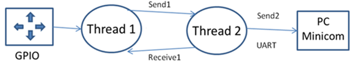

# Laboratory 9: FreeRTOS Threads and Queues

## Objective
To strengthen your knowledge and abilities about real time operating systems, specifically how to use threads and queues.

## Introduction
This lab provides you the opportunity to learn how to develop embedded software applications using a real time operating system. This lab will help you understand how to schedule tasks and how to exchange data between threads using queues. 

__HARDWARE__
<div align="center">

Qty | Material
:---: | :---
1 | Arduino Zero
1 | USB-microusb cable
1 | Dip Switch
4 | Resistors 4.7k
4 | Resistors 1k
1 | FTDIO for serial communication
1 |USB-miniusb cable
</div>

__SOFTWARE__

- :white_check_mark: FreeRTOS code
- :white_check_mark: `myprintf`, `uart.c` and `uart.h` routines
- :white_check_mark: Atmel/Microchip Studio
- :white_check_mark: PuTTY

## Lab work

### __Part I: Setting up FreeRTOS for the SAMD21G18 processor__

1. Download the following FreeRTOS files adjusted for Arduino zero from the link below. Place the downloaded folder as shown:

    `C:\Users\Username\Documents\Atmel Studio\7.0\FreeRTOS`

2. Create a _GCC C Executable_ project in ATMEL studio.

3. On the Solution Explorer, create two folders: `include` and `source` and move the contents from your FreeRTOS folder to the respective created folders on your project: `include → include` and `src → source`

4. Copy all the files from the folder indicated below and paste them into the source folder at the solution explorer. 
C:\Users\YOURUSErNAME\Documents\Atmel Studio\7.0\FreeRTOS\src

5. Paste the following code into your `main.c`:

```c
/* Kernel includes. */
#include "sam.h"
#include "FreeRTOS.h"
#include "task.h"
#include "queue.h"
#include "uart.h"
#include "myprintf.h"

/* Priorities at which the tasks are created. */
#define myTASK_TASK_PRIORITY         	( tskIDLE_PRIORITY + 1 )

void my_task(void *p) {
    	while(1) {
            	static uint32_t i = 0;
            	myprintf("\nHello World task 1 %d", i++);
            	vTaskDelay(1000);
    	}
}

int main()
{
    	SystemInit();
    	/* Switch to 8MHz clock (disable prescaler) */
    	SYSCTRL->OSC8M.bit.PRESC = 0;	
    	initUART();

    	
    	xTaskCreate( my_task,        	    /* The function that implements the task. */
            	    "my_task",              /* The text name assigned to the task. */
            	    512,            	    /* The size of the stack to allocate to the task. */
            	    NULL,           	    /* The parameter passed to the task  */
            	    myTASK_TASK_PRIORITY,   /* The priority assigned to the task. */
            	    NULL );         	    /* The task handle is not required, so NULL is passed.                  */

    	/* Start the tasks and timer running. */
    	vTaskStartScheduler();

    	for( ;; );
    	return(0);
}
```

6. Build the application and connect your development board to the PC using the serial port. Run the program and demonstrate to your professor (print screens) that the messages are properly displayed at the Serial Port terminal (PuTTy). 

### __Part II. Getting familiar with Threads and Queues under FreeRTOS__
View the video found in this link and follow the indications of the presenter step by step (you may want to stop the video to type the code).

<div align="center">

[](https://www.youtube.com/watch?v=8lIpI30Tj-g)
</div>

1. Your program should display the following messages at the end:

        Send 0 to receiver task
        Received 0

Demonstrate to your professor (print screens) that these messages were displayed at the PC terminal and show you code. Report your code at this point within your report document. No need to upload files at this point.

2. Your program should display the following messages at the end:

        Send 0 to receiver task
        Received 0
        Failed to receive data from queue
        Send 1 to receiver task
        Received 1

Demonstrate to your professor that these messages were displayed at the PC terminal and show you code. Report your final code including it in your document along with print screens of your program working correctly. Upload the files with your code as well. Report an explanation of the reason for displaying “Failed to receive data from queue”.

### __Part III. Coding using the FreeRTOS to exchange messages and control peripherals__
<div align="center">

</div>

Connect four switches to the parallel ports. The messages associated with each switch listed in the table below. Add the schematic diagram to the report.

<div align="center">

Switch  | Message | Comment
:---: | :--- | :---
1  | Up		| Arduino Zero, pin [D2]
2  | Down	| Arduino Zero, pin [D3]
3  | Left	| Arduino Zero, pin [D4]
4  | Right	| Arduino Zero, pin [D5]
</div>

Example code to read a push-button from Arduino Zero. The next code turns-on the TX LED while the push-button (pull-up configuration) is pressed. 

```c
#include "sam.h"

PORT->Group[ 0 ].PINCFG[ PIN_PA16 ].reg = 0x2; //bit INEN must be set for input pins
PORT->Group[ 0 ].PINCFG[ PIN_PA27 ].reg = 0x0; //bit PMUXEN must be clear for GPIOs
    	
PORT->Group[ 0 ].DIRCLR.reg = PORT_PA16; //pin 16 declared as data input
PORT->Group[ 0 ].DIRSET.reg = PORT_PA27; //pin 27 TX LED declared as data output
 
while (1) {
if( ( PORT->Group[ 0 ].IN.reg & PORT_IN_IN( PORT_PA16 ) ) == _U_( 0x00000000 ) )
            	PORT->Group[ 0 ].OUTCLR.reg = PORT_PA27;
    	else
            	PORT->Group[ 0 ].OUTSET.reg = PORT_PA27;
}
```

__Thread 1 should:__
1. Read the switches from GPIO PORT
2. Send a message to Thread 2 notifying that a switch was pushed (switch number/message) 
3. Wait and read the acknowledgement from Thread 2. After receiving the acknowledgement, it is ready to send the next message.

__Thread 2 should:__
1. Receive and read the data from Thread 1
2. Display in the serial port the button direction of the pressed button: `Up` / `Down` / `Right` / `Left`
3. Acknowledge the message reception and waits for the message.

Demonstrate to your professor that these messages were displayed at the PC terminal and show you code. Report your final code including it in your document along with print screens of your program working correctly. Upload the files with your code as well.

## Deliverables
Turn in a technical report that includes the following information:

1. Introduction

   * Explain what you did in this laboratory
   * Include a brief explanation of each .C file written for your project

2. Results 

__Part I__
- [x] Screenshot of properly-displayed messages from `main.c` on the Serial Port terminal (PuTTy).

__Part II__
- [x] Screenshot of message on the Serial Port terminal:

        Send 0 to receiver task
        Received 0

- [x] Screenshot of message on the Serial Port terminal:

        Send 0 to receiver task
        Received 0
        Failed to receive data from queue
        Send 1 to receiver task
        Received 1

- [x] Explain why message "`Failed to receive data from queue`" was displayed.

__Part III__
- [x] Screenshot of message on the Serial Port terminal showing the pressed button.

3. Individual conclusions

   * Interpretation of results
   * Applications of and improvements of exercises
   * Justification in case of any errors

4. Appendix A
   * Link to the GitHub repository with all the working codes for Parts I through IV of the laboratory. 
   * Link to a video showing your working code and explaining the indicated items for Parts I through IV. 
